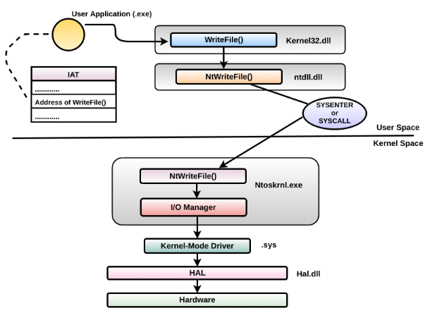
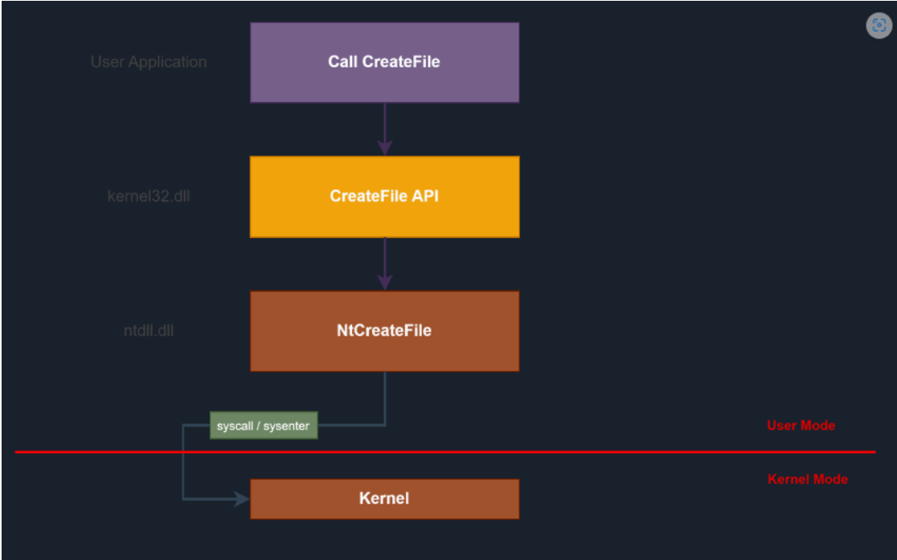

-> Two different modes: User Mode and Kernel Mode.

-> 

-> Flow:
    User Processes --> Subsystem DLLs(kernel32.dll, ntdll.dll, advapi32.dll) --> Ntdll(Native API) --> Executive kernel(ntoskrnl.exe)

-> 

->  Windows API simply acts as a wrapper for the Native API.
